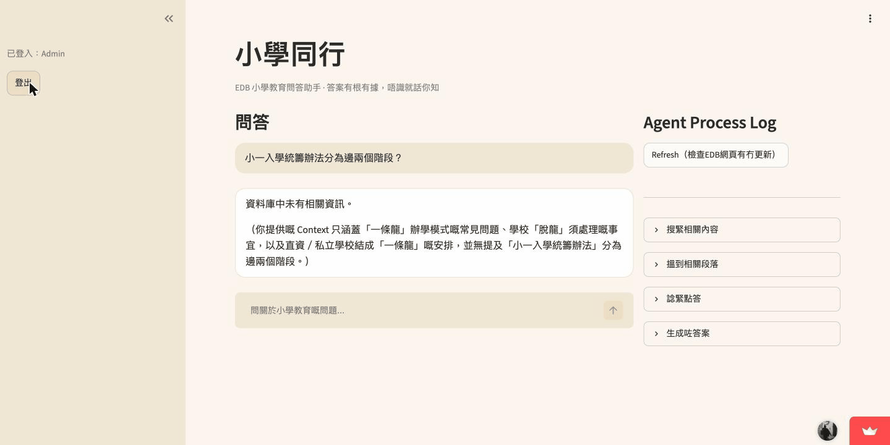
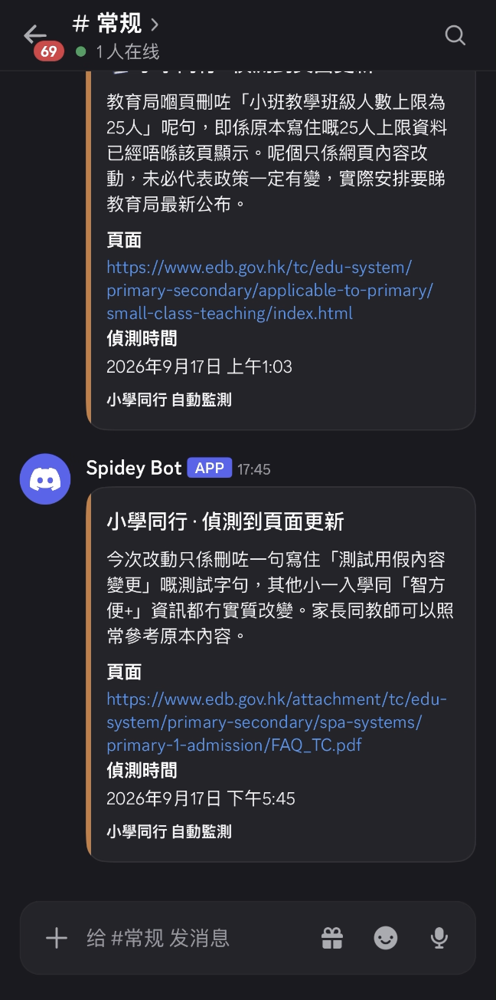

# 小學同行


A grounded Q&A agent over Hong Kong's EDB primary-education policy pages — ask it a question, it answers from indexed source pages with inline citations, and says "I don't know" instead of making something up when a page doesn't cover it.

## Contents

- [Overview](#overview)
- [Demo](#demo)
- [Quick start](#quick-start)
- [Configuration](#configuration)
- [Usage](#usage)
- [Project structure](#project-structure)
- [Testing](#testing)
- [Deployment](#deployment)

## Overview

Parents and teachers looking up EDB policy — whole-day schooling, direct subsidy scheme, P1 admission — currently have to dig through a maze of HTML pages and PDFs on the EDB site. This app indexes that content once and lets you ask it directly, in Cantonese, with every answer traceable back to the page it came from.

Four things it does:

1. **Grounded Q&A** — retrieves relevant chunks from Supabase pgvector, feeds them to DeepSeek as context, and requires the model to cite `[Section Title](URL)` for anything it states. If nothing relevant is in the index, it says so rather than guessing.
2. **Agent tool calling** — the LLM can call `get_section_last_updated` to check when a section last changed, and the call is visible live in the sidebar, not hidden behind the scenes.
3. **Change detection** — hashes each tracked page's normalized text and diffs it against the last snapshot stored in Supabase.
4. **Push notifications** — when a page changes, DeepSeek summarizes the diff in plain Cantonese and posts it to a Discord webhook, so nobody has to read a raw HTML diff.

**Stack**: Streamlit for the UI, DeepSeek (`deepseek-flash`) for generation and tool calling, a local `sentence-transformers` model (`intfloat/multilingual-e5-small`) for embeddings, Supabase (Postgres + pgvector) for storage and retrieval, Discord webhooks for notifications.

This indexes a fixed set of 25 EDB pages plus one whitelisted PDF — not a general crawler — and runs behind a single admin login with no self-registration. Scope and auth choices like these are deliberate for a single-tenant demo, not gaps; see the technical note's scalability section for what changes past that.

## Demo



Grounded Q&A (in-domain, out-of-domain, and an edge-case question), the tool-call trace, and a detected page change pushed to Discord — all in one recording.

The Discord notifications below come from the same demo. The page changes were staged by editing the stored snapshot, so the described diffs are test content, not real EDB edits.



## Eval results

50 hand-written questions run through the real retrieval and agent code (`scripts/eval.py`), 2026-09-30: 30 in-domain, 12 out-of-domain, 8 edge cases. Each in-domain question has an expected source page and a key fact the answer must contain, both checked by string match. The questions are mine, not an independent benchmark. I ran it twice and got the same three misses, but LLM output varies, so treat a point or two as noise.

| Measure | Result |
|---|---|
| Right source page retrieved, in-domain | 30/30 (100%, 95% CI 89-100%) |
| Chunk containing the key fact retrieved, in-domain | 29/30 (97%, 95% CI 83-99%) |
| Answer correct, in-domain | 29/30 (97%, 95% CI 83-99%) |
| Correct decline, out-of-domain | 12/12 (100%, 95% CI 76-100%) |
| Cited links matching the known source list | 50/50 (100%, 95% CI 93-100%) |
| Edge cases judged correct | 3/5 (the other 3 of 8 have no fixed answer and are scored on retrieval only) |

Page-level hit rate flatters retrieval, which is why the chunk-level row is there. All three misses are retrieval failures, not the model making things up; it declined because the fact wasn't in what it was given:

- 校本支援服務入面邊個組別負責中學校本課程發展？ The right page is retrieved, but not the chunk that names 中學校本課程發展組.
- 喺邊度可以攞到小一入學申請表？ Same pattern on the admission FAQ PDF: right document, wrong chunk in the top 5.
- "What is the Direct Subsidy Scheme in Hong Kong?" The right page ranks first, but at 0.79 similarity it falls under the 0.85 threshold, so nothing is passed to the model. English queries against a Chinese index need a lower threshold or a query-translation step.

Reproduce with `python scripts/eval.py` (needs `.env` and an ingested index; results go to `eval_results.json`, which is gitignored). Two questions ask for circular numbers from the 數字教育 news list, so they will go stale when EDB updates that page. Unit tests are separate and run in CI on every push.

## Quick start

**Requirements**: Python 3.11+, a Supabase project, a DeepSeek API key, a Discord webhook URL (optional, only needed for push notifications).

```bash
git clone <this repo>
cd EduPulse-HK
python3 -m venv venv
source venv/bin/activate
pip install -r requirements.txt
```

Copy `.env.example` to `.env` and fill in your keys (see [Configuration](#configuration) below), then create the Supabase schema:

```bash
psql "$SUPABASE_DB_URL" -f sql/supabase_schema.sql
# or paste sql/supabase_schema.sql into the Supabase SQL editor
```

Ingest the source pages, then run the app:

```bash
python ingest.py       # scrapes EDB pages + the whitelisted PDF, embeds and stores chunks
streamlit run app.py
```

Open the URL Streamlit prints. First load is slower than usual — the embedding model has to load into memory once.

## Configuration

`.env`:

```
DEEPSEEK_API_KEY=       # https://platform.deepseek.com
SUPABASE_URL=           # your Supabase project URL
SUPABASE_KEY=           # service_role key — not anon, see note below
SUPABASE_PROJECT_ID=    # Supabase project ref
DISCORD_WEBHOOK_URL=    # Server Settings → Integrations → Webhooks → Copy URL
```

`document_chunks` and `page_snapshots` have Row Level Security enabled with no policies, so reads and writes only work through the `service_role` key — the `anon` key is deliberately left unable to touch either table. This app runs entirely server-side (Streamlit), so `service_role` never reaches a browser.

The source page list lives in `config.py` (`EDB_URLS`, `PDF_URLS`) rather than a database table — adding a page to track means adding a URL there and re-running `ingest.py`.

## Usage

Ask a question in the chat box. The right-hand "Agent Process Log" panel shows what the agent actually did to answer it — retrieval, similarity scores, the generation step — so you can see it's not just printing canned text.

Questions asked in the app are stored in the Supabase `query_log` table so failures can be debugged after a redeploy: the question and answer, when it was asked (the server clock when the app received the question, shown in HKT to the millisecond), an anonymous per-session id, whether it declined, and the cited URLs. No IP address or user agent is kept. Read it in the Supabase table view or with:

```sql
select asked_at_hkt, session_id, question, declined
from query_log order by asked_at desc limit 50;
```

There's no automatic cleanup; prune by hand with `delete from query_log where asked_at < now() - interval '90 days';`.

To check EDB pages for updates and push a Discord notification on anything that changed:

```bash
python -c "from change_detect import check_updates; from notify import notify_all_changes; notify_all_changes(check_updates())"
```

or click "Refresh（檢查EDB網頁有冇更新）" in the app. There's no scheduler wired up here — run this from cron, a GitHub Actions schedule, or by hand.

## Project structure

```
app.py             Streamlit UI — chat, login gate, agent trace panel, refresh button
rag.py              retrieval: embeds the query, calls Supabase's match_document_chunks RPC
agent.py            DeepSeek tool-calling loop, get_section_last_updated tool
llm_client.py       DeepSeek chat client + embed_query/embed_passage (asymmetric e5 prefixes)
scraper.py           HTML fetch + chunking for EDB pages
pdf_scraper.py        PDF fetch + per-page chunking (pypdf)
ingest.py           one-off pipeline: scrape/extract → chunk → embed → store in Supabase
change_detect.py     hash + diff each tracked page against its last snapshot
notify.py             posts a change summary to the Discord webhook
db.py                 Supabase client + query helpers
config.py             source URLs, model names, thresholds, prompts
sql/supabase_schema.sql   table + RPC definitions
tests/                 unit tests (mocked) + integration tests (live DeepSeek/Supabase)
```

Ingestion, change detection, and notifications are independent of the Streamlit request path and share no state with it beyond the Supabase client — you can run `ingest.py` or the change check from a plain script without touching the app.

## Testing

```bash
pytest                   # unit tests, no credentials needed
pytest -m integration    # exercises live DeepSeek + Supabase, needs ingest.py run first
```

## Deployment

Runs as-is on Streamlit Community Cloud's free tier — push to GitHub, deploy from [share.streamlit.io](https://share.streamlit.io) with `app.py` as the entry point, and paste the same keys from `.env` into the app's Secrets. First deploy takes a few minutes to install `torch` + `sentence-transformers`.

The free tier sleeps the app after inactivity (10-60s cold start on the next visit) and caps RAM around 1GB, which is tight but workable for this model's footprint.
